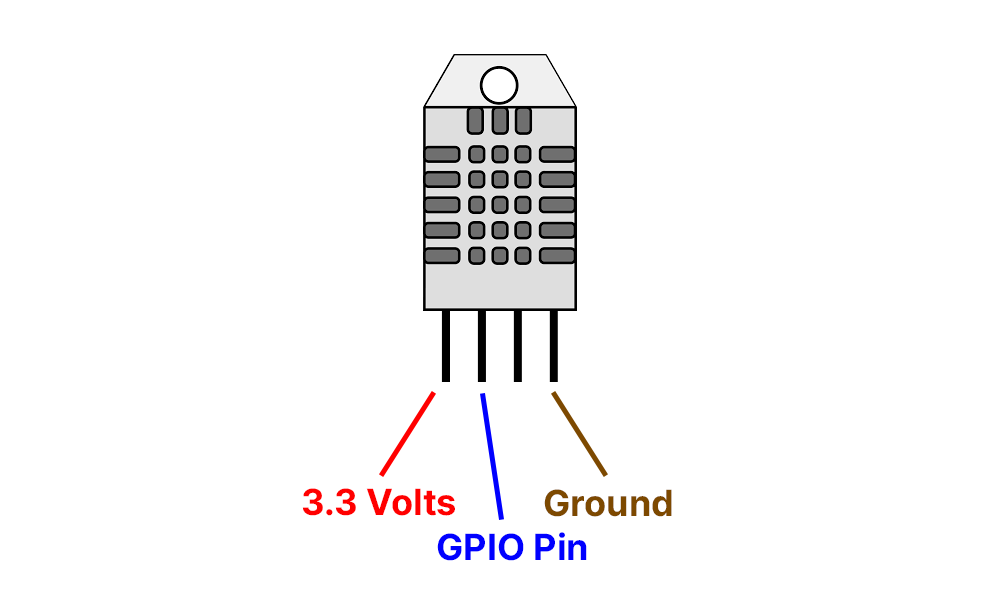

# Connecting DHT22 & ESP32

## Connecting the DHT22 Temperature sensor to the ESP32

- Ensure the ESP32 is powered off
- Following the below diagram of a DHT22, connect the DHT22 to the ESP32, either directly or using a breadboard. Note that the third pin is left disconnected.



- Once connected, plug the ESP32 into your Raspberry Pi so we can test the DHT22 temperature sensor.
- ```rshell --buffer-size=30 -p /dev/ttyUSB0``` into your ESP32 from your Pi.
- Type ```repl``` to enter the MicroPython interface.
- enter the below code, changing the pin number to the GPIO pin on your ESP32 that you connected your DHT22 to.
```
import dht
from machine import Pin
sensor = dht.DHT22(Pin(4))
sensor.measure()
temperature = sensor.temperature()
print('Temperature: %3.1f C' %temperature)
```
- If your DHT22 is connected successfully, you will get an output such as ``` Temperature: 18.8 C ```